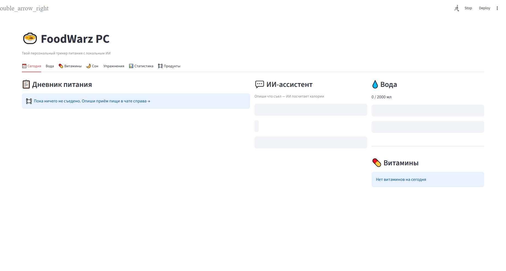
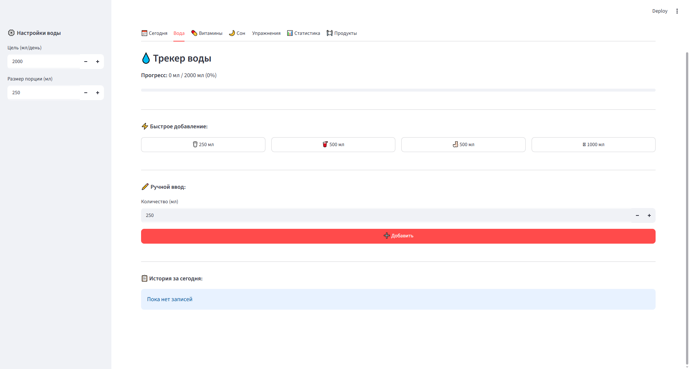
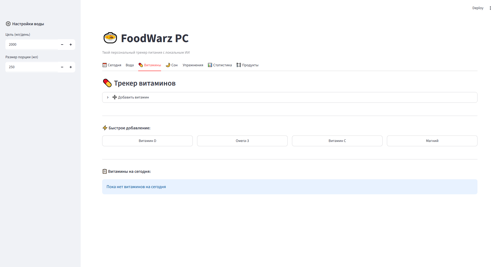
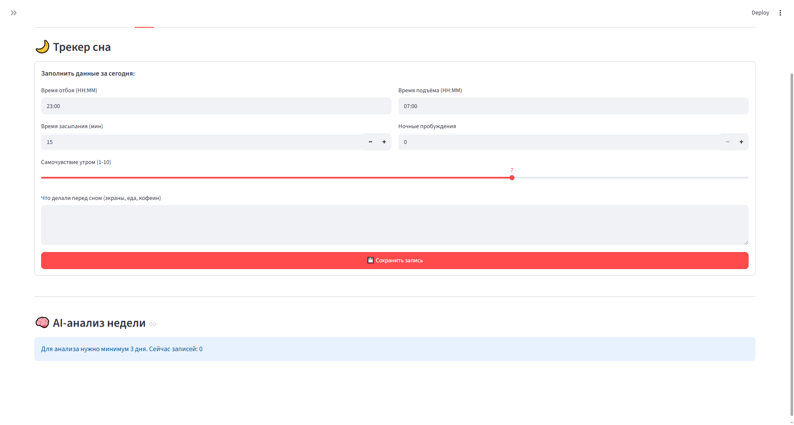
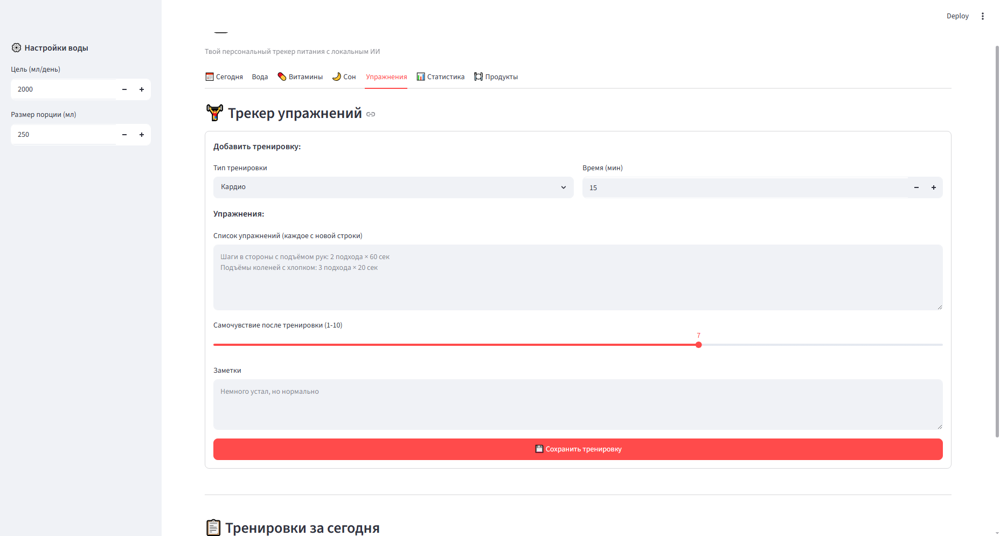
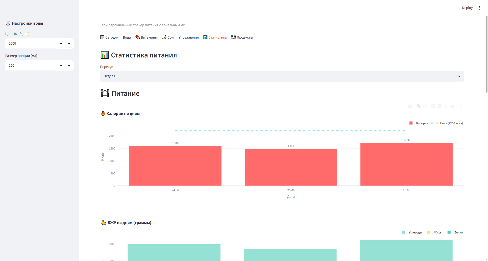
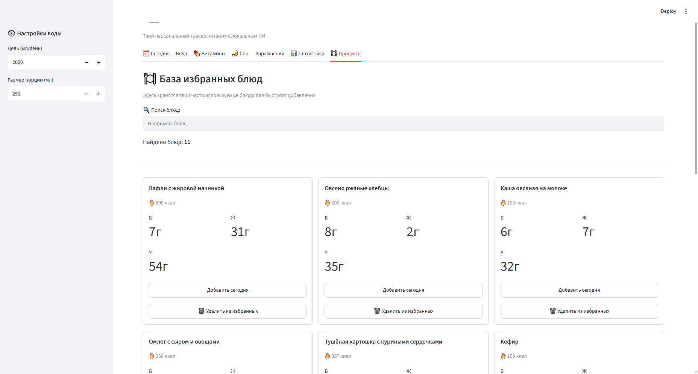

# 🍲 FoodWarz PC

Персональный трекер питания с локальным ИИ-ассистентом для анализа приёмов пищи.

## ✨ Особенности

- **Приватность**: Все данные хранятся локально, ничего не отправляется в облако
- **Локальный ИИ**: Использует Qwen2.5-7B через llama.cpp — бесплатно и без лимитов
- **Умный парсинг**: Опиши еду обычным текстом — ИИ сам посчитает КБЖУ
- **Избранные блюда**: Быстрое добавление часто употребляемых продуктов
- **Аналитика**: Графики и статистика за неделю/месяц
- **Редактирование**: Возможность корректировать КБЖУ вручную

## 🛠️ Стек технологий

- **Frontend**: Streamlit (Python)
- **Backend**: Python 3.10+
- **База данных**: SQLite
- **ИИ-модель**: Qwen2.5-7B-Instruct (Q4_K_S квантизация)
- **Локальный сервер**: llama.cpp (OpenAI-совместимый API)
- **Валидация данных**: Pydantic

## 📋 Требования

- Python 3.10 или выше
- Зависимости из `requirements.txt`
- Модель Qwen2.5-7B-Instruct в формате GGUF (~4.5 ГБ)
- Минимум 8 ГБ RAM (рекомендуется 16 ГБ)

## 🚀 Установка и запуск

### 1. Клонирование репозитория

```bash
git clone https://github.com/username/FoodWarzPC.git
cd FoodWarzPC
```

### 2. Виртуальное окружение

```bash
python -m venv venv
```

Для Windows:

```bash
venv\Scripts\activate
```

### 3. Установка зависимостей

```bash
pip install -r requirements.txt
```

### 4. Запуск

```bash
streamlit run app.py
```

## 📸 Скриншоты

### Главный экран — Дневник питания


### Трекер воды


### Трекер витаминов


### Трекер сна


### Трекер упражнений


### Статистика


### Избранное (Продукты)


## 📁 Структура проекта

```
FoodWarzPC/
├── app.py
├── config.py
├── database/
│   ├── __init__.py
│   ├── models.py
│   └── repository.py
├── food_diary.db
├── requirements.txt
├── services/
│   ├── __init__.py
│   └── ai_service.py
├── ui/
│   ├── __init__.py
│   ├── chat_tab.py
│   ├── diary_tab.py
│   ├── exercise_tab.py
│   ├── products_tab.py
│   ├── sleep_tab.py
│   ├── stats_tab.py
│   ├── today_tab.py
│   ├── vitamins_tab.py
│   └── water_tab.py
├── utils/
│   ├── __init__.py
│   └── parsers.py
```

## 🎯 Использование

- **Дневник питания**: Вкладка "Сегодня" позволяет просматривать и редактировать приёмы пищи.
- **Избранное**: Вкладка "Продукты" содержит список избранных блюд.
- **Вода**: Вкладка "Вода" отслеживает количество выпитой воды.
- **Витамины**: Вкладка "Витамины" отслеживает приемы витаминов.
- **Сон**: Вкладка "Сон" отслеживает качество сна.
- **Упражнения**: Вкладка "Упражнения" отслеживает выполненные тренировки.
- **Статистика**: Вкладка "Статистика" предоставляет графики и данные за неделю и месяц.

## ⚙️ Конфигурация

- **calorie_goal**: Целевое количество калорий (установлено в config.py).
- **protein_goal**: Целевое количество белка (установлено в config.py).
- **fat_goal**: Целевое количество жира (установлено в config.py).
- **carbs_goal**: Целевое количество углеводов (установлено в config.py).
- **water_goal_ml**: Целевое количество выпитой воды в мл (установлено в config.py).
- **vitamins**: Список витаминов, которые необходимо принимать ежедневно (установлено в config.py).

## 🔧 Решение проблем

1. **Ошибка: "ModuleNotFoundError: No module named 'database.models'"**
   - Решение: Убедитесь, что virtual environment активирован и `database` папка включена в пути.

2. **Ошибка: "TypeError: 'NoneType' object is not iterable"**
   - Решение: Проверьте, что все функции, которые возвращают объекты, действительно возвращают что-то, а не `None`.

3. **Ошибка: "ConnectionError: HTTPConnectionPool"**
   - Решение: Убедитесь, что `llama.cpp` сервер запущен и доступен по локальной сети.

##  Планы развития

- [ ] Добавление поддержки дополнительных моделей ИИ
- [ ] Улучшение пользовательского интерфейса
- [ ] Добавление поддержки других единиц измерения

## 📄 Лицензия

MIT License.

## 🙏 Благодарности

Благодарим команду OpenAI за разработку модели Qwen2.5-7B-Instruct и разработчиков `llama.cpp` за создание локального сервера.
